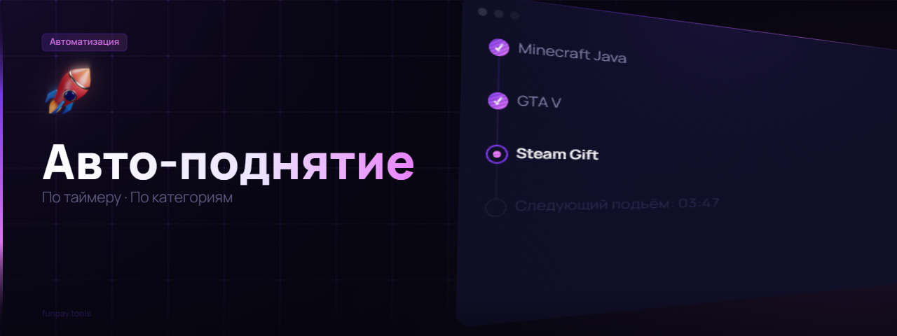
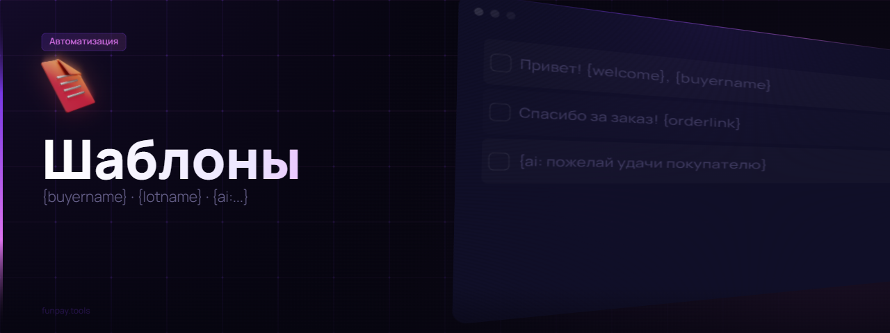
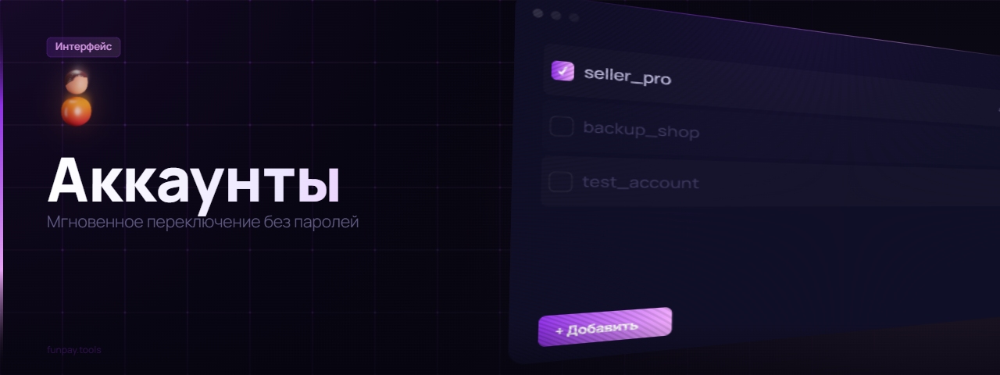

  
  
  
  

 

  

 

**FunPay Tools** - это полностью бесплатное браузерное расширение с открытым исходным кодом, созданное для продавцов на FunPay. Оно добавляет мощные инструменты на базе AI, полную кастомизацию интерфейса, автоматизацию рутинных задач и множество других функций, которые упрощают работу и помогают увеличить продажи.

---

> [!NOTE]
> Также доступна мобильная версия: **[FunPay Tools для Android](https://github.com/XaviersDev/FunPay-Tools-Android)** - полноценное приложение с мессенджером, автоответчиком, авто-поднятием и XD Dumper прямо на телефоне.

---

  

| Функция | Описание |
| :--- | :--- |
| **AI-Ассистент в чате** | Превращает любой черновик в вежливое профессиональное сообщение. Написал "ку ща выдам" - получил "Здравствуйте! Сейчас выдам товар, одну минуту." |
| **AI-Генератор лотов** | Создаёт названия и описания в вашем уникальном стиле, анализируя существующие предложения. Просто опишите идею. |
| **AI-Ответ на отзывы** | Генерирует уместный ответ одним кликом на странице заказа, упоминая купленный товар. |
| **AI-Переводчик** | Встроенный переводчик для названий, описаний и сообщений покупателю. |
| **AI-Генератор изображений** | Стильные превью для лотов по текстовому описанию: иконка, фон, стиль - всё автоматически. |
| **🔍 ИИ-Аудит магазина** | ИИ изучает ваши лоты и отзывы, задаёт ~40 вопросов и выдаёт персональные рекомендации - конкретно по вашим ценам, описаниям и общению с покупателями, а не общие советы. |

---

  

| Функция | Описание |
| :--- | :--- |
| **Темы и фоны** | Анимированные GIF-фоны, статичные обои, настройка цветов и прозрачности. Галерея из 10+ готовых тем (горы, космос, неон) - применяются в один клик. |
| **Тёмная тема** | Кнопка мгновенного включения идеальной тёмной темы. |
| **"Волшебная Палочка" (Live Styler)** | Редактируйте любой элемент сайта в реальном времени: цвет, размер, видимость. Сохраняйте свой уникальный стиль. |
| **Продвинутые шрифты** | Уникальные Unicode-шрифты и клавиатура с символами для оформления лотов. |
| **Эффекты курсора** | Анимированные частицы или собственное изображение курсора. Оптимизировано для слабых машин. |
| **Экспорт и импорт тем** | Делитесь темами с другими пользователями одним файлом. |

---

  

| Функция | Описание |
| :--- | :--- |
| **Экспорт и импорт лотов** | Полные резервные копии всех лотов в один файл. Перенос между аккаунтами или восстановление после удаления. |
| **Улучшенный импорт** | Откладывайте на 24 часа если FunPay выдал лимит - возобновите позже. Пропускайте отдельные лоты. |
| **Копирование любого лота** | На странице любого (даже чужого) лота - кнопка "Копировать". При создании своего - вставьте данные одним кликом. |
| **Массовое редактирование** | Меняйте название, описание или сообщение покупателю сразу у нескольких лотов. Переменные `{current}` и `{lotname}`. |
| **Быстрое редактирование цены** | Клик на цену прямо на странице - поле ввода рядом. Нажал ✓ - готово. Без лишних переходов. |
| **Контекстное меню (ПКМ)** | ПКМ на лоте: закрепить, написать продавцу, скопировать ссылку. Shift+ПКМ - стандартное меню браузера. |
| **Массовое управление** | Удаляйте, дублируйте, отключайте лоты пачками. Выбор целой категории одним кликом. |
| **Продвинутое клонирование** | Копируйте лоты в разные категории массово - например, на десятки серверов за раз. |
| **Поиск по лотам** | Мгновенная фильтрация без перезагрузки. Escape сбрасывает. |
| **Поиск продавца по нику** | Строка в шапке сайта: карточка с выручкой, отзывами, средним чеком и топ-3 категориями. |
| **Заметки о пользователях** | Цветные метки прямо в чате. Фильтрация чатов по меткам. |
| **Конвертер Cardinal** | Переносите лоты из Cardinal в FP Tools в один клик. |

---

  

| Функция | Описание |
| :--- | :--- |
| **Копилки** | Финансовые цели с отслеживанием в шапке сайта. |
| **Аналитика рынка** | Сводка по категории: число лотов, продавцов, средняя цена, конкуренты онлайн. |
| **Авто-поднятие лотов** | По таймеру, с фильтром по категориям и наличию автовыдачи. |
| **Уведомления в Discord** | Webhook-оповещения с пингом @everyone / @here. |
| **Статистика продаж** | Аналитика за любой период: средний чек, популярные товары, лучшие покупатели, неподтверждённые заказы. |
| **Таймер заказов** | Обратный отсчёт у каждого оплаченного заказа. Краснеет при остатке < 6 часов. |
| **Метки типа заказа** | Рядом с заказом сразу виден тип: 🟢 Сделка / 🟣 Обычный. |
| **Экспорт / импорт настроек** | Все настройки в один файл `.fpconfig`. Спасёт при переустановке или смене компьютера. |
| **Калькулятор валют** | Удобный конвертер прямо в меню расширения. |

---

  

*   **Авто-приветствие** - Пишет первым новым покупателям. Настраиваемый кулдаун, опция "только совсем новые чаты", фильтр системных сообщений.
*   **Новые триггеры** - Автоответ при оплате заказа покупателем и при подтверждении получения.
*   **Авто-ответ на отзывы** - Разные шаблоны для оценок от 1 до 5 звёзд.
*   **Бонус за 5★ отзыв** - Автоматически отправляет бонус (текст, промокод или картинку) за пятизвёздочную оценку.
*   **Ответы на команды** - Настройте триггеры ("!реквизиты") для мгновенных ответов.
*   **Умные переменные** - `{buyername}`, `{lotname}`, `{orderid}`, `{orderlink}` и AI-генерация `{ai:пожелай хорошего дня}`.
*   **Изображения в шаблонах** - Вставляйте картинки прямо в шаблоны и поля авто-ответов.
*   **Имитация набора текста** - Перед отправкой - выглядит естественнее.
*   **Анти-спам** - Распознаёт рассылки FunPay "Уважаемые продавцы" и никогда не отвечает на них.
*   **Интеграция с ЧС** - Все автоответы полностью интегрированы с чёрным списком.

---

  

*   Полностью переделанный интерфейс: лоты сгруппированы по категориям, у каждого виден остаток товаров.
*   **Авто-деактивация** - Когда товары заканчиваются, лот сам отключается, чтобы не принимать невыполнимые заказы.
*   **Авто-активация** - Пополнили товары - лот сам включается обратно. Оба режима настраиваются независимо.
*   Улучшенный конвертер Cardinal-лотов - правильно преобразовывает поля автовыдачи.

---

  

*   **Черновики** - Ушли в другой чат и вернулись - написанный текст никуда не делся. Как в настоящем мессенджере.
*   **История покупок** - Меню чата → "📦 История покупок" → количество заказов, общая сумма, что и когда покупал.
*   **Перевод сообщений** - Все входящие не на русском переводятся прямо под оригиналом.
*   **Экспорт переписки** - Меню чата → "💾 Экспортировать чат" → сохраняет всю историю в `.txt`.
*   **Кнопка "Прочитать всё"** - Сбрасывает все непрочитанные сообщения одним кликом.

---

  

*   **Менеджер аккаунтов** - Добавляйте и переключайте аккаунты в любом порядке. Расширение само разбирается с сессиями - мгновенно, без сброса.
*   **Тикеты прямо в меню** - Список обращений с цветными статусами, переписка, создание и закрытие одной кнопкой. На support.funpay.com больше заходить не нужно.
*   **Чёрный список** - Гибкие настройки для каждого человека: отключить автовыдачу, автоответы или уведомления по отдельности. Кнопка в меню чата.
*   **Опознаватель "Свой-Чужой"** - Метка в шапке чата, если собеседник тоже использует FP Tools.

---

  

> [!NOTE]
> Хочешь управлять продажами со смартфона? Встречай **FunPay Tools для Android** - отдельное нативное приложение с полноценным мессенджером, автоответчиком, XD Dumper (авто-снижение цены), вечным онлайном и виджетами на рабочий стол.

| Функция | Описание |
| :--- | :--- |
| **Мессенджер** | Полноценный чат с черновиками, медиа, папками, метками и историей покупок |
| **Автоответчик** | Работает в фоне даже при закрытом приложении |
| **XD Dumper** | Авто-снижение/повышение цены для удержания топа поиска |
| **Вечный онлайн** | Статус "Онлайн" пока запущена служба |
| **Авто-поднятие** | Переписанная логика, максимальная стабильность |
| **Виджеты** | Баланс и профиль прямо на рабочем столе Android |
| **И много чего** | Это просто ваша мечта |

---

### 📥 Установка

1.  Перейдите в [**Chrome Web Store**](https://chromewebstore.google.com/detail/funpay-tools/pibmnjjfpojnakckilflcboodkndkibb/)
2.  Нажмите кнопку "Установить".
3.  После установки на панели инструментов браузера появится иконка FP Tools.

---

### 🚀 Как начать

1.  Зайдите на сайт [FunPay](https://funpay.com/).
2.  В верхней панели навигации (хедере) появится новая кнопка **"FP Tools"**.
3.  Нажмите на нее, чтобы открыть главное меню расширения и настроить все функции под себя.

---

Расширение бесплатное и разрабатывается на энтузиазме. Если оно помогло вам заработать - поставьте ⭐ и поделитесь с друзьями!

---

### 📄 Лицензия

Проект распространяется под лицензией MIT. Подробности в файле `LICENSE`.

